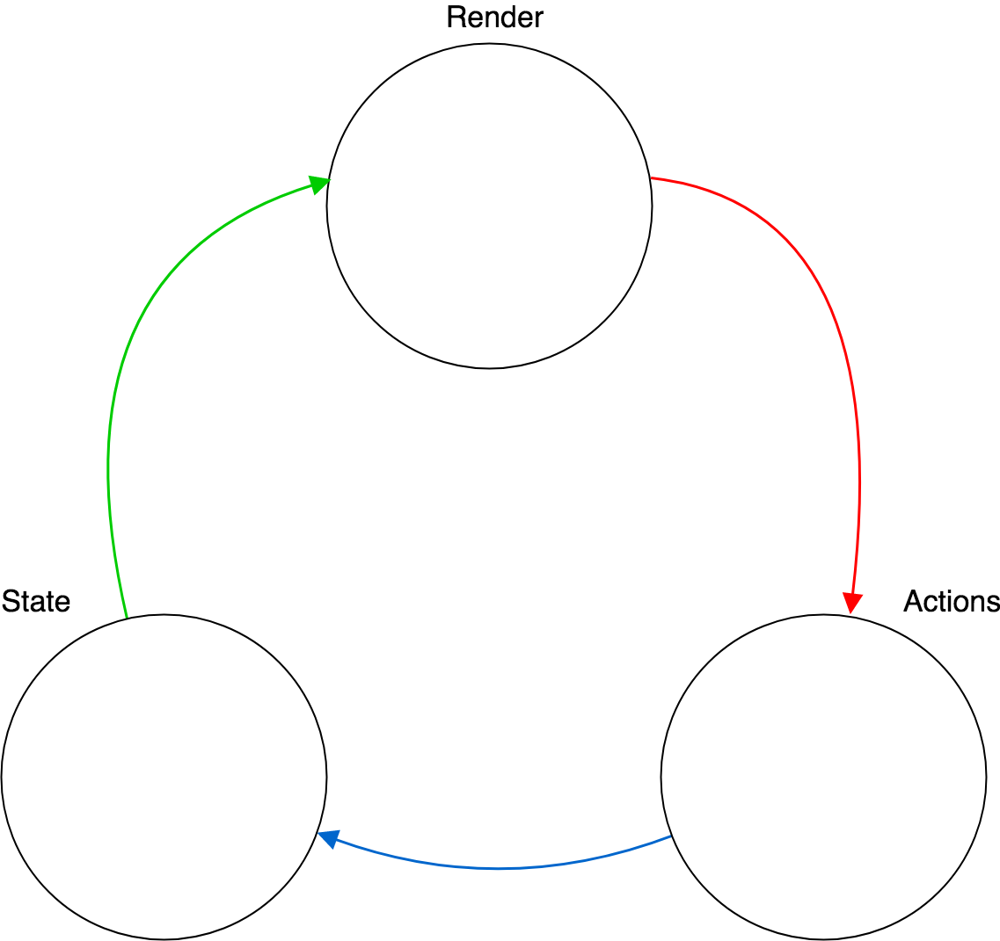
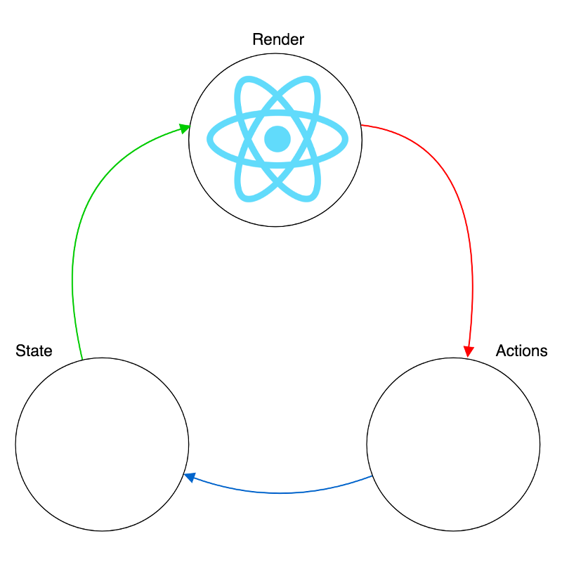
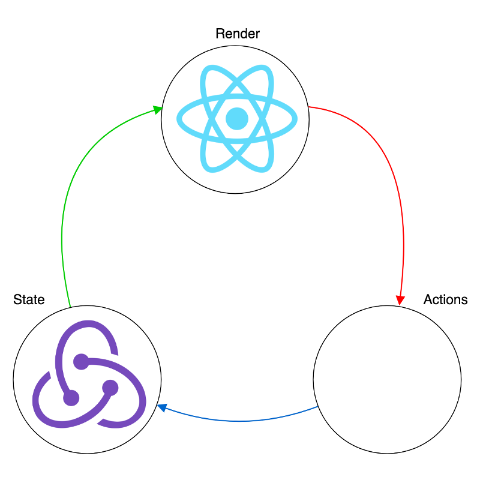
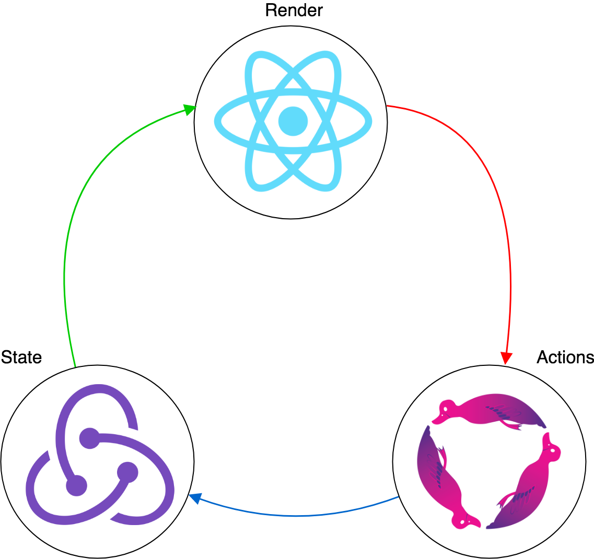

# One-Way Data Flow

Pierre Segalen

@fa[twitter gp-contact](@psegalen)

---



---



---

### React

* Composants
* Etat local
* JSX (balises dans JS)
* DOM virtuel

[Exemple](https://codepen.io/gaearon/pen/amqdNA?editors=0010)

---

### React

```javascript
class Clock extends React.Component {
  constructor(props) {
    super(props);
    this.state = { date: new Date() };
  }

  componentDidMount() {
    this.timerID = setInterval(() => this.tick(), 1000);
  }

  componentWillUnmount() {
    clearInterval(this.timerID);
  }

  tick() {
    this.setState({
      date: new Date()
    });
  }

  render() {
    return (
      <div>
        <h1>Hello, world!</h1>
        <h2>It is {this.state.date.toLocaleTimeString()}.</h2>
      </div>
    );
  }
}

ReactDOM.render(<Clock />, document.getElementById("root"));
```

@[31](Rendu en JSX d'un composant "Clock".)
@[1](Déclaration du composant.)
@[2-5](Initialisation de l'état local.)
@[7-9](Cycle de vie, exécuté après le premier rendu.)
@[11-13](Cycle de vie, exécuté avant la suppression de l'instance.)
@[15-19](Appelé dans le setInterval déclaré dans componentDidMount.)
@[21-28](Rendu du composant.)

---



---

### Redux

* Etat applicatif
* Découpé en sous-états appelés "Reducers"
* Reducer = fonction pure
* Données immutables

---


